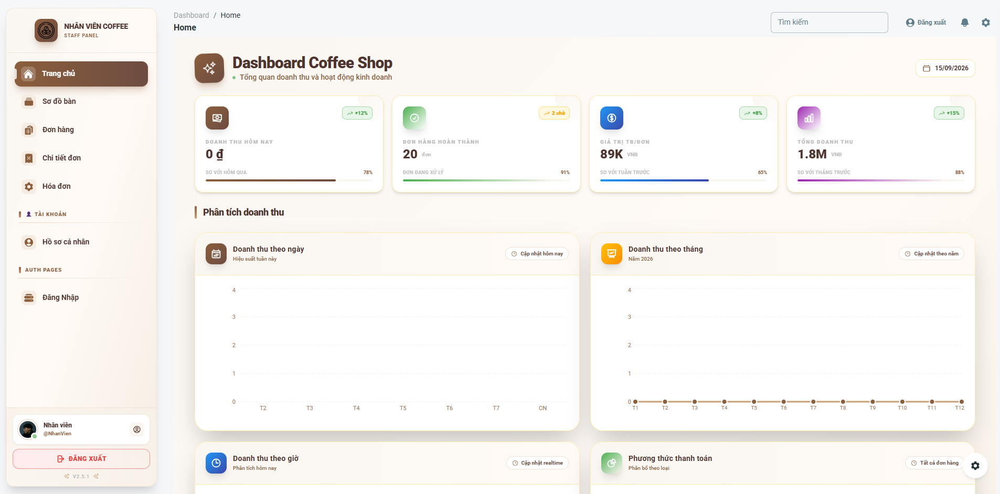
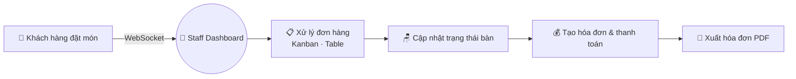
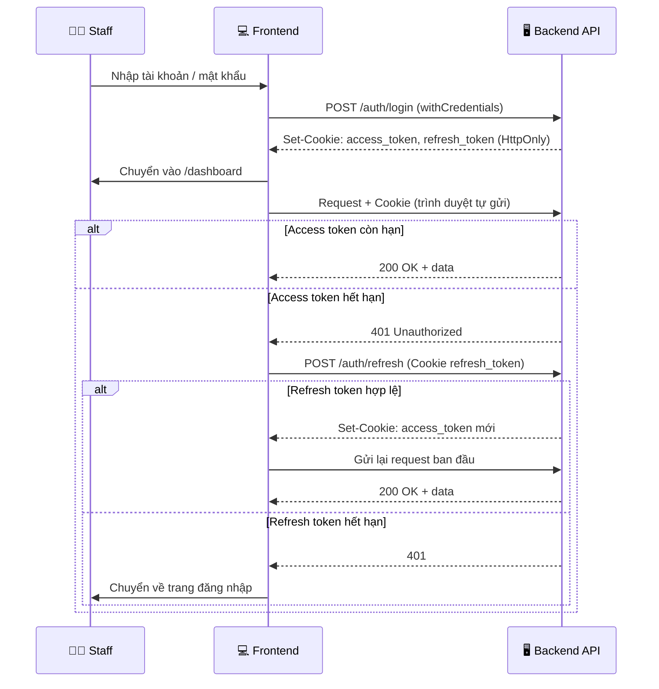

<div align="center">


#  Coffee Shop Staff Dashboard
## Giao Diện Nhân Viên (Frontend — Coffee-Staff)

**Ứng dụng quản lý đơn hàng, bàn và thanh toán realtime dành cho nhân viên quán cà phê**

[](#)
[](./LICENSE)
[](https://react.dev/)
[](https://vitejs.dev/)

[](https://tailwindcss.com/)
[](https://www.material-tailwind.com/)
[](#-kết-nối-websocket)
[](#-authentication--bảo-mật)
[](#-authentication--bảo-mật)
[](#-triển-khai)

<br>



<sub>Giao diện minh họa — Material Tailwind Dashboard</sub>

</div>

<br>

<div align="center">

### 🧭 Một phần của hệ sinh thái Coffee Shop Management

| ☕ `cafe` (Backend) | 🛠️ `Frontend(Coffee-Admin)` | 👨‍💼 `Frontend(Coffee-Staff)` |
|:---:|:---:|:---:|
| Spring Boot · MySQL · WebSocket | Toàn quyền quản trị hệ thống | **Bạn đang ở đây** — vận hành ca làm việc |

</div>

---

## 📑 Mục lục

<table>
<tr>
<td valign="top" width="50%">

- [📖 Giới thiệu](#-giới-thiệu)
- [✨ Tính năng chính](#-tính-năng-chính)
- [🎯 Phạm vi của Staff](#-phạm-vi-của-staff)
- [🛠️ Công nghệ sử dụng](#️-công-nghệ-sử-dụng)
- [📦 Cấu trúc thư mục](#-cấu-trúc-thư-mục)
- [🧩 Convention của một module](#-convention-của-một-module)

</td>
<td valign="top" width="50%">

- [🚀 Bắt đầu nhanh](#-bắt-đầu-nhanh)
- [🔌 Kết nối WebSocket](#-kết-nối-websocket)
- [🔐 Authentication & Bảo mật](#-authentication--bảo-mật)
- [⚙️ Cấu hình môi trường](#️-cấu-hình-môi-trường)
- [🚀 Triển khai](#-triển-khai)
- [🐛 Xử lý sự cố](#-xử-lý-sự-cố)

</td>
</tr>
</table>

---

## 📖 Giới thiệu

> **Frontend (Coffee-Staff)** là phân hệ giao diện dành cho nhân viên phục vụ, xây dựng trên **React 18 + Vite** và **Material Tailwind**, đồng bộ **realtime** với khách hàng qua WebSocket.

Khác với Admin, giao diện Staff được **tối giản có chủ đích** để nhân viên thao tác nhanh trong ca làm việc: nhận đơn mới tức thì, cập nhật trạng thái đơn và món, theo dõi sơ đồ bàn, xuất hóa đơn PDF — không bị phân tán bởi các chức năng quản trị (sản phẩm, danh mục, người dùng, khuyến mãi...).

<div align="center">



</div>

---

## ✨ Tính năng chính

<table>
<tr>
<td width="50%" valign="top">

### 🏠 Dashboard (`home.jsx`)
Tổng quan ca làm việc
- Thẻ thống kê (`StatisticsCard`)
- Biểu đồ thống kê (`StatisticsChart`)

### 📋 Đơn hàng ⭐ (`orders/`)
Chức năng trung tâm
- Nhận đơn **realtime** (`useSocketOrders`)
- Bảng **Kanban** kéo theo trạng thái (`OrderKanban`)
- Chế độ xem dạng bảng (`OrderTable`) kèm lọc, tìm kiếm, thống kê
- **Modal thông báo đơn mới** (`OrderNotificationModal`)
- Đổi trạng thái đơn nhanh (`useOrderStatusMutation`)
- Tạo / sửa / xem đơn, xem trước phiếu (`OrderReceiptPreview`)

### 🧾 Chi tiết đơn hàng (`orderitems/`)
- Các món trong đơn, cập nhật realtime (`useSocketOrderItems`)
- Hiển thị thay đổi của từng món (`OrderItemChangeIndicator`)
- Tạo / sửa / xem, xem trước phiếu (`OrderItemReceiptPreview`)

</td>
<td width="50%" valign="top">

### 🪑 Quản lý bàn ⭐ (`tables/`)
Sơ đồ trực quan
- Trạng thái bàn cập nhật realtime (`useSocketTables`)
- Đổi trạng thái bàn nhanh (`useTableStatusMutation`)
- Lọc, tìm kiếm, xem chi tiết bàn (`show.jsx`)
- Thẻ xem trước bàn (`TablePreviewCard`)

### 💰 Thanh toán ⭐ (`bill/`)
Hóa đơn & thu ngân
- Tạo / sửa / xem hóa đơn từ đơn hàng
- Cấu hình hóa đơn (`billConfig`)
- Xem trước biên lai (`BillReceiptPreview`) và nội dung hóa đơn (`InvoiceContent`)
- **Xuất hóa đơn PDF** (`useBillPdf`)
- Lọc và thống kê hóa đơn

### 👤 Hồ sơ (`profile.jsx`)
- Thông tin tài khoản nhân viên

### 🔔 Realtime
- Kết nối socket tập trung qua `socket.js` + `SocketContext`
- Đơn mới, đổi trạng thái đơn/món/bàn hiển thị ngay không cần tải lại

</td>
</tr>
</table>

> ⭐ = Chức năng chính, thiết kế riêng cho quy trình vận hành của nhân viên.

---

## 🎯 Phạm vi của Staff

Giao diện Staff chỉ có **4 module nghiệp vụ**, ít hơn Admin:

| Module | 🛠️ Admin | 👨‍💼 Staff |
|---|:---:|:---:|
| Đơn hàng (`orders`) | CRUD | CRUD + Kanban + realtime ⭐ |
| Chi tiết đơn (`orderitems`) | CRUD | CRUD + realtime |
| Hóa đơn (`bill`) | CRUD | CRUD + xuất PDF ⭐ |
| Bàn (`tables`) | CRUD | Xem + cập nhật trạng thái (không tạo/sửa) ⭐ |
| Sản phẩm · Danh mục · Khuyến mãi · Người dùng | CRUD | ❌ Không có trang quản lý |
| Báo cáo · Roles · Log · Settings... | ✅ | ❌ Không có |

> ℹ️ Staff vẫn có `productApi`, `categoryApi`, `promotionApi`, `userApi` trong `src/api/` để lấy dữ liệu phục vụ lên đơn / hóa đơn, nhưng **không có trang quản lý** các mục này.

---

## 🛠️ Công nghệ sử dụng

<div align="center">


</div>

| Nhóm | Công nghệ |
|---|---|
| **Core** | React 18, Vite, JavaScript (JSX) |
| **UI/UX** | Material Tailwind, TailwindCSS |
| **Giao tiếp API** | Axios (`withCredentials`) + interceptor tự refresh token |
| **Server State** | React Query (`src/lib/queryClient.js`) |
| **Realtime** | SockJS + STOMP (`src/socket.js`, `context/SocketContext.jsx`) |
| **Global State** | React Context API |
| **Form & Validation** | Custom hooks (`useXxxForm`) + `schemas/*Schema.js` |
| **Thông báo** | Toast helper (`src/lib/toast.js`) |
| **Authentication** | Access Token + Refresh Token trong **HttpOnly Cookie** |
| **Code style** | Prettier |
| **Triển khai** | Genezio (`genezio.yaml`), tương thích Vercel/Netlify |

---

## 📦 Cấu trúc thư mục

```
Frontend(Coffee-Staff)/
├── 📁 public/
│   ├── css/tailwind.css
│   └── img/                        # Ảnh, favicon, video minh họa
│
├── 📁 src/
│   ├── 📁 api/                     # Tầng giao tiếp API
│   │   ├── axiosClient.js          # Axios + interceptor refresh token
│   │   ├── AuthAPI.js              # Đăng nhập / refresh / đăng xuất
│   │   ├── orderApi.js             # ⭐ Đơn hàng
│   │   ├── orderitemApi.js         # Chi tiết đơn hàng
│   │   ├── billApi.js              # ⭐ Hóa đơn & thanh toán
│   │   ├── tableApi.js             # ⭐ Bàn
│   │   ├── productApi.js           # Lấy dữ liệu sản phẩm khi lên đơn
│   │   ├── categoryApi.js
│   │   ├── promotionApi.js
│   │   └── userApi.js
│   │
│   ├── 📁 configs/                 # charts-config.js, index.js
│   ├── 📁 context/
│   │   ├── SocketContext.jsx       # ⭐ Chia sẻ kết nối WebSocket
│   │   └── index.jsx               # Global state (React Context)
│   ├── 📁 data/                    # Dữ liệu tĩnh cho thống kê
│   ├── 📁 layouts/                 # auth.jsx, dashboard.jsx
│   ├── 📁 lib/                     # queryClient.js, toast.js
│   │
│   ├── 📁 pages/
│   │   ├── 📁 auth/                # sign-in.jsx, sign-up.jsx
│   │   └── 📁 dashboard/
│   │       ├── home.jsx            # Tổng quan ca làm việc
│   │       ├── profile.jsx         # Hồ sơ cá nhân
│   │       ├── 📁 orders/          # ⭐ Kanban + Table + thông báo đơn mới
│   │       ├── 📁 orderitems/      # Chi tiết đơn hàng
│   │       ├── 📁 bill/            # ⭐ Hóa đơn, biên lai, xuất PDF
│   │       └── 📁 tables/          # ⭐ Sơ đồ & trạng thái bàn (index, show)
│   │
│   ├── 📁 utils/
│   │   └── imageHelpers.js         # Hàm hỗ trợ xử lý ảnh
│   │
│   ├── 📁 widgets/
│   │   ├── cards/                  # StatisticsCard, ProfileInfoCard, MessageCard
│   │   ├── charts/                 # StatisticsChart
│   │   ├── layout/                 # Sidenav, Navbar, DashboardNavbar, Footer, Configurator
│   │   ├── loaders/                # CoffeeLoader
│   │   └── pagination/             # Pagination
│   │
│   ├── App.jsx · main.jsx · routes.jsx
│   └── socket.js                   # ⭐ Cấu hình kết nối WebSocket
│
├── genezio.yaml                    # Cấu hình triển khai Genezio
├── prettier.config.cjs
├── tailwind.config.cjs
├── vite.config.js
├── jsconfig.json
├── postcss.config.cjs
├── index.html
├── package.json
├── CHANGELOG.md · ISSUE_TEMPLATE.md · LICENSE · README.md
└── .gitignore
```

---

## 🧩 Convention của một module

Các module `orders`, `orderitems`, `bill` có đầy đủ cấu trúc:

```
orders/
├── 📁 components/      # Header, Filters, Search, Stats, Table, Kanban, ...
│   └── index.js        # Barrel export
├── 📁 constants/       # messages.js + cấu hình riêng (orderStatus.js)
├── 📁 hooks/           # useOrders · useOrderForm · useOrderMutations · useOrderStats
│                       # useOrderStatusMutation · useSocketOrders
├── 📁 schemas/         # orderSchema.js — validate form
├── 📁 utils/           # formatters.js
├── index.jsx           # Danh sách
├── create.jsx          # Tạo mới
├── edit.jsx            # Chỉnh sửa
└── show.jsx            # Xem chi tiết
```

Module `tables` là bản rút gọn vì Staff **không tạo/sửa bàn**: chỉ có `index.jsx`, `show.jsx`, hooks `useTables` · `useTableStatusMutation` · `useSocketTables`, không có `schemas/`.

| Hook | Vai trò |
|---|---|
| `useXxx` | Lấy danh sách / chi tiết (React Query) |
| `useXxxMutations` | Tạo, sửa, xóa |
| `useXxxForm` / `useXxxFormData` | Quản lý form và dữ liệu phụ trợ cho form |
| `useXxxStats` | Tính thống kê hiển thị |
| `useXxxStatusMutation` | Đổi trạng thái nhanh (đơn, bàn) |
| `useSocketXxx` | Lắng nghe sự kiện realtime và cập nhật dữ liệu |
| `useBillPdf` | Xuất hóa đơn PDF |

---

## 🚀 Bắt đầu nhanh

### ✅ Yêu cầu hệ thống

| Yêu cầu | Phiên bản |
|---|---|
| Node.js | 16+ (khuyến nghị 18+) |
| npm / yarn | 8+ / 1.22+ |
| Backend API | đang chạy tại `http://localhost:8080` |
| WebSocket Server | đang chạy tại `http://localhost:3001` |

### ⚡ Cài đặt

```bash
# 1️⃣ Clone dự án
git clone <repository-url>
cd "Frontend(Coffee-Staff)"

# 2️⃣ Cài đặt dependencies
npm install

# 3️⃣ Chạy development server
npm run dev
```

<div align="center">

🌐 Ứng dụng chạy tại **http://localhost:3003**

</div>

**Build production:**

```bash
npm run build      # Tạo bản build trong thư mục dist/
npm run preview    # Preview bản build
```

### 🔑 Tài khoản dùng thử

```yaml
Username: NhanVien
Password: 123456
```

---

## 🔌 Kết nối WebSocket

Kết nối được khởi tạo trong `src/socket.js` và chia sẻ cho toàn app qua `context/SocketContext.jsx`. Mỗi module có hook `useSocketXxx` riêng để subscribe và cập nhật dữ liệu:

| Hook | Module | Mục đích |
|---|---|---|
| `useSocketOrders` | `orders` | Nhận đơn mới, cập nhật trạng thái đơn |
| `useSocketOrderItems` | `orderitems` | Cập nhật các món trong đơn |
| `useSocketTables` | `tables` | Cập nhật trạng thái bàn |

<details>
<summary><b>📄 Xem ví dụ cấu hình <code>src/socket.js</code></b></summary>

```javascript
import SockJS from 'sockjs-client';
import Stomp from 'stompjs';

const socket = new SockJS('http://localhost:3001');
const stompClient = Stomp.over(socket);

stompClient.connect({}, (frame) => {
  console.log('Connected: ' + frame);

  stompClient.subscribe('/topic/orders', (message) => {
    const newOrder = JSON.parse(message.body);
    // cập nhật cache React Query + hiện OrderNotificationModal
  });
});

export default stompClient;
```

</details>

**📡 Topic tham khảo:**

| Topic | Mục đích |
|---|---|
| `/topic/orders` | Nhận đơn hàng mới từ khách |
| `/topic/orders/{orderId}` | Cập nhật trạng thái đơn cụ thể |
| `/topic/tables/{tableId}` | Cập nhật trạng thái bàn |

---

## 🔐 Authentication & Bảo mật

Hệ thống dùng **Access Token + Refresh Token**, cả hai được backend gửi về qua **HttpOnly cookie**.

| Thành phần | Mô tả |
|---|---|
| **Access Token** | Token ngắn hạn, xác thực mỗi request tới API |
| **Refresh Token** | Token dài hạn, chỉ dùng để xin access token mới |
| **HttpOnly Cookie** | JavaScript **không đọc được** token (`document.cookie` / `localStorage` không thấy) → chống đánh cắp token qua XSS |
| **`withCredentials: true`** | Axios tự gửi cookie kèm mỗi request |
| **Auto Refresh** | Khi nhận `401`, interceptor gọi endpoint refresh rồi gửi lại request ban đầu |
| **Logout** | Gọi API đăng xuất để backend xóa cookie, frontend chuyển về trang đăng nhập |

> 🛡️ Toàn bộ route trong dashboard là **Protected Routes** — chưa xác thực hoặc refresh thất bại sẽ chuyển về trang đăng nhập.

<details>
<summary><b>🔑 Xem sơ đồ luồng đăng nhập & refresh token</b></summary>



</details>

### 🔧 Yêu cầu phía Backend

- Set cookie với `HttpOnly`, `Secure` (production/HTTPS) và `SameSite` phù hợp
- CORS **`allowCredentials(true)`** và `allowedOrigins` là origin cụ thể (**không** dùng `*`)
- Có endpoint refresh token và logout (xóa cookie)

---

## ⚙️ Cấu hình môi trường

Tạo file `.env` tại thư mục gốc:

```env
VITE_API_URL=http://localhost:8080/api
VITE_WS_URL=http://localhost:3001
VITE_APP_NAME=Coffee Shop Staff
```

> 💡 Kiểm tra `baseURL` trong `src/api/axiosClient.js` và địa chỉ socket trong `src/socket.js` khớp với backend đang chạy. Restart `npm run dev` sau khi sửa `.env`.

---

## 🚀 Triển khai

<table>
<tr>
<td width="33%" align="center">

**Genezio**
```bash
genezio deploy
```
<sub>Cấu hình trong `genezio.yaml`</sub>
</td>
<td width="33%" align="center">

**Vercel**
```bash
npm run build
vercel --prod
```
</td>
<td width="33%" align="center">

**Netlify**
```bash
npm run build
netlify deploy --prod --dir=dist
```
</td>
</tr>
</table>

> ⚠️ Vì dùng HttpOnly cookie, khi deploy production cần **HTTPS** và cấu hình `Secure` / `SameSite` / CORS tương ứng.

---

## 🐛 Xử lý sự cố

<details>
<summary><b>❌ Đăng nhập xong nhưng request sau bị 401</b></summary><br>

- Axios đã bật `withCredentials: true`
- Backend CORS có `allowCredentials(true)` và `allowedOrigins` là `http://localhost:3003` (không phải `*`)
- Cookie `SameSite` / `Secure` phù hợp môi trường (HTTP local khác HTTPS production)
- Frontend và backend khác domain khi deploy → cần `SameSite=None; Secure`
</details>

<details>
<summary><b>❌ WebSocket không kết nối được</b></summary><br>

- Backend WebSocket đang chạy đúng cổng
- URL trong `socket.js` / `VITE_WS_URL` chính xác
- CORS đã cho phép WebSocket
- Thử fallback transport:

```javascript
const socket = new SockJS('http://localhost:8080/ws', null, {
  transports: ['websocket', 'xhr-streaming', 'xhr-polling'],
});
```
</details>

<details>
<summary><b>❌ Không nhận được đơn hàng realtime</b></summary><br>

- Xác nhận WebSocket đã kết nối thành công
- Kiểm tra hook `useSocketOrders` đã subscribe đúng topic
- Kiểm tra format message từ backend
- Bật debug STOMP:

```javascript
stompClient.debug = (str) => console.log('STOMP: ' + str);
```
</details>

<details>
<summary><b>❌ Xuất hóa đơn PDF lỗi / thanh toán không thành công</b></summary><br>

- Đơn hàng phải ở trạng thái hợp lệ để tạo hóa đơn
- Kiểm tra tổng tiền và phương thức thanh toán
- Kiểm tra kết nối tới backend API
</details>

---

## 🤝 Đóng góp

<table>
<tr>
<td width="20%" align="center">1️⃣<br><b>Fork</b></td>
<td width="20%" align="center">2️⃣<br><b>Tạo branch</b></td>
<td width="20%" align="center">3️⃣<br><b>Commit</b></td>
<td width="20%" align="center">4️⃣<br><b>Push</b></td>
<td width="20%" align="center">5️⃣<br><b>Pull Request</b></td>
</tr>
</table>

```bash
git checkout -b feature/TenTinhNang
git commit -m 'Add: mô tả tính năng'
git push origin feature/TenTinhNang
```


---

<div align="center">

## 📄 Giấy phép & Liên hệ

Phát hành theo giấy phép **MIT** — xem chi tiết tại [`LICENSE`](./LICENSE)

**Tác giả: Hoàng Đạt**

[](mailto:hoangdat.engineer@gmail.com)
[](https://github.com/HoangPhungThanhDat)

<br>

 **Made with React & Vite — dành riêng cho nhân viên quán cà phê** ⚛️

<sub>Nếu dự án hữu ích, đừng quên để lại ⭐ trên repository!</sub>

</div>